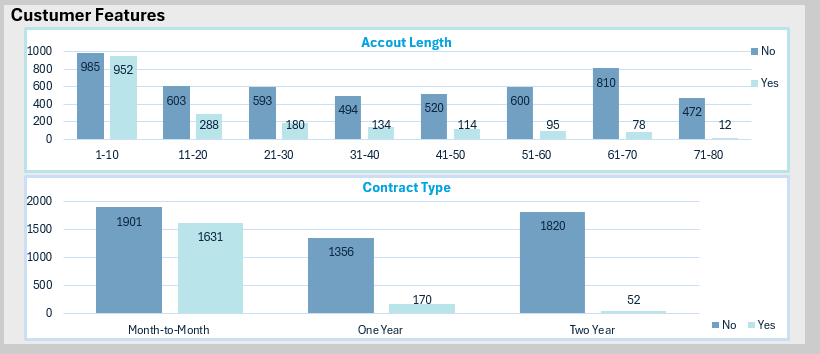

# Descifrando el Abandono en Amazon Prime

<div style="text-align: center;">
     
</div>

Este proyecto tiene como objetivo analizar la tasa de abandono (churn) de clientes Amazon Prime, utilizando datos históricos y mostrando los resultados en un dashboard interactivo.

## Descripción del Proyecto

El análisis de churn busca identificar patrones y factores que contribuyen al abandono de clientes.
El resultado final de este proyecto es un dasboard que permite visualizar métricas calve, análisis descriptivos y gráficos interactivos para comprender mejor el comportamiento de los clientes.

He actualizado la sección de herramientas utilizadas para reflejar los cambios que mencionaste. Si necesitas más modificaciones o quieres añadir algo más, avísame:

## Herramientas Utilizadas

Este proyecto se desarrolló utilizando las siguientes herramientas:

- **Excel**: Para la consolidación de datos y creación del dashboard final.
- **Git**: Para el control de versiones y colaboración en el proyecto.
- **GitHub**: Como repositorio central para almacenar y documentar el proyecto.

## Estructura del Proyecto

```bash
Analisis_Amazon/

|---Data/      #Carpeta con los archivos utilizados
|  |
|  |---Data_Analisis/    #Resultados del análisis descriptivo
|  |
|  |  |---amazon_churn_analisis_descriptivo.xlsx
|  |  |---Analisis_descriptivo_cat_temp_churn.xlsx
|  |  |___Analisis_descriptivo_num_churn.xlsx
|  |
|  |---Data_Dashboard/        #Carpeta con el archivo dashboard final
|  |
|  |  |___Dashboard.xlsx
|  |
|  |---Data_raw/        #Datos originales sin procesar
|  |
|  |  |___amazon_churn_datosbrutos.xlsx
|  |
|  |---Data_transformacion/        #Carpeta con los datos transformados previos al análisis
|  |
|  |  |___amazon_churn_transformacion.xlsx
|  |
|---IMG/       #Imégenes para documentación y presentación
|  |
|  |---PortadaAmazonChurn.webp
|  |---DashboardAmazonChurn.png
|  |
|---Recap de sesiones/        #Carpeta con los documentos resumen de cada sesión
|  |
|  |---Recap primera sesion.docx
|  |---Recap segunda sesion.docx
|  |---Recap tercera sesion.docx
|  |---Recap cuarta sesion.docx
|  |---Recap quinta sesion.docx
|  |---Recap sexta sesion.docx
|  |___Recap septima sesion.docx
|  |
|___README.md
```

## Estructura de Datos

El archivo de datos original (procedente de un Dataset de Kaggle) consta de varias columnas:

- **CustomerID**: Identificador único de cada cliente.
- **Churn Label**: Etiqueta que indica si el cliente se fue (Yes ) o no (No).
- **Churned**: Variable binaria (0 o 1) que indica si el cietne abandonó el servicio (1) o se mantuvo (0).
- **Account Length (in months)**: Tiempo que el cliente ha estado suscrito al servicio, en meses.
- **Customer Service Calls**: Número de llamadas realizadas al servicio de atención al cliente.
- **Avg. Monthly GB Download**: Promedio mensual de datos descargados por el cliente en GB
- **Unlimited Data Plan**: Indica si el cliente tiene un plan de datos ilimitado (1: Sì , 0:No)
- **Extra Data Charges**: Cargos adicionales por uso de datos más allá del límite del plan.
- **State**: Estado de residencia del cliente.
- **Phone Number**: Número de teléfono del cliente.
- **Gender**: Género del cliente.
  **Age**: Edad del cliente.
- **Under 30**: Indica si el cliente es menor de 30 años (1: Sì , 0:No).
- **Senior**: Indica si el cliente es mayor de 65 años (1: Sì , 0:No).
- **Group**: Indica si el cliente tiene contratado un plan familiar.
- **Number of Customers in Group**: Número de clientes que pertenecen al mismo plan familiar.
- **Device Protection & Online Backup**: Indica si el cliente tiene protección de dispositivo y respaldo en línea.
- **Contract Type**: Tipo de contrato(Mensual, anual, etc.).
- **Payment Method**: Método de pago utilizado por el cliente.
- **Monthly Charges**: Cargo mensual que el cliente paga por el servicio.
- **Total Charges**: Cargos totales acumulados durante la suscripción.
- **Churn Category**: Categoría que indica el motivo de la deserción (churn).
- **Churn Reason**: Razón específica por la que el cliente abandonó el servicio.
- **Contact Date**: Fecha del último contacto con el cliente.
- **Last Transaction Date**: Fecha de la última transacción realizada por el cliente.
- **Tenure(in months)**: Tiempo total de suscripción del cliente.
- **Customer Segment**: Clasificación del cliente según su nivel de uso o importancia (Alto, Medio, Bajo).
- **Average Monthly Expenses**: Gasto promedio mensual del cliente
- **Number of Complaints of support**: Número de quejas o interacciones con el servicio de soporte
- **Preferec Contact Method**: Método preferido por el cliente para ser contactado (email teléfono,etc.).
- **Applied Discount**: Indica si se ha aplicado algún descuento al cliente.
- **Hobby**: Pasatiempos del cliente.
- **Favorite TV Show**: Programa de televisión favorito del cliente.
- **Internal Notes**: Notas internas relacionadas con el cliente.

## Desarrollo del proyecto

Este apartado detalla las sesiones de trabajo llevadas a cabo para desarrollar el análisis y construir el dashboard. Cada sesión está interconectada, formando un flujo lógico de actividades: desde la exploración inicial de los datos, pasando por la transformación y análisis descriptivo, hasta la elaboración del dashboard final. Estas sesiones reflejan la evolución del proyecto y cómo cada etapa aporta al objetivo global.

### Primera sesion

- Entendimiento general del conjunto de datos y de las columnas.
- Para este propósito, se emplearon técnicas como la exploración visual inicial de las variables, el uso de estadísticas descriptivas básicas y la creación de gráficos simples para identificar tendencias y patrones preliminares en los datos.

### Segunda sesion

- Eliminación de columnas, establecimiento del tipo de los datos y normalización de datos.

### Tercera sesion

- Análisis descriptivo de las columnas numéricas

### Cuarta sesion

- Análisis descriptivo de las columnas categóricas y temporales.

### Quinta sesion

- Análisis descriptivos de las columnas numéricas junto con la columna objetivo.

### Sexta sesion

- Análisis descriptivos de las columnas categòricas y temporales junto con la columna objetivo.
- Creacion de nuevas columnas.

### Septima sesion

- Elección de las columnas relevantes para el Dashboard.

### Octava sesion

- Creación del Dashboard final

## Dashboard

<div style="text-align: center;">
     
</div>

El dashboard interactivo incluye los siguientes elementos clave:

- **Tasa de Abandono**: Se visualiza el porcentaje de clientes que abandonaron el servicio (26,74%) respecto al total.
- **Métricas Generales**: Indicadores clave como el número total de clientes (6687), el gasto promedio mensual (32,05) y los gastos promedio de clientes que abandonan (36,64) frente a los que permanecen (28,84).
<div style="text-align: center;">
     
</div>

- **Gráficos de Abandono**: Desgloses sobre las razones del abandono, con "Mejores ofertas de la competencia" como el principal factor, y cómo las llamadas al servicio técnico correlacionan con el churn.
<div style="text-align: center;">
     
</div>

- **Características de Clientes**: Información agrupada sobre la longitud de la cuenta, tipo de contrato (mensual, anual, etc.), y la relación con la retención de clientes.
<div style="text-align: center;">
     
</div>

- **Última Transacción**: Análisis temporal del comportamiento de las transacciones más recientes.
<div style="text-align: center;">
     
</div>

- **Filtros Interactivos**: Los filtros interactivos permiten al usuario profundizar en la información mediante la segmentación de datos por grupo de edad, método de pago y tipo de cuenta. Estos filtros enriquecen la experiencia al ofrecer la capacidad de analizar patrones específicos dentro de subgrupos relevantes, como comparar gastos entre diferentes grupos de edad o estudiar cómo los tipos de contrato afectan el churn.
<div style="text-align: center;">
     
</div>

## Conclusiones

- Tenemos una tasa de abandono del 26,74%
- El gasto promedio de las personas que abandonan el servicio, es un 6% superior a la media de gasto mensual, mientras que para las personas que siguen en la plataforma es de un 2% inferior.
- La principal razon de este abandono es una mejor oferta de la competencia
- Hemos observado como al aumentar el número de llamadas al servicio de atención al cliente, aumenta el porcentaje de abandono del servicio
- Los contratos de larga duracion(un año / dos años) tienen un efecto beneficioso, ya que disminuye drasticamente la tasa de abandono
- El abandono está estrechamente relacionado con el método de pago (aumentando en el caso de débito y tarjetas) y con las multicuentas (aumentando en el caso de cuentas individuales)
- Estas conclusiones tienen un impacto directo en las estrategias de retención de Amazon Prime, permitiendo centrar los esfuerzos en ofrecer promociones competitivas frente a otras plataformas, mejorar la calidad del soporte al cliente y fomentar contratos de mayor duración mediante descuentos o beneficios adicionales. Además, una mejor segmentación y personalización de los servicios podría mejorar la retención en los grupos más propensos al abandono. Por ejemplo, priorizar esfuerzos en clientes con métodos de pago asociados a mayores tasas de churn o diseñar campañas específicas para fomentar contratos a largo plazo podrían ser estrategias efectivas respaldadas por los datos obtenidos.

## Contribuciones

Las contribuciones a este proyecto son muy bienvenidas. Si tienes alguna sugerencia, mejora o corrección, puedes colaborar de las siguientes maneras:

- Realizando un pull request con mejoras de código o documentación.
- Proporcionando feedback mediante comentarios en el repositorio.
- Proponiendo nuevas ideas o funcionalidades en la sección de Issues.

¡Gracias por tu ayuda y colaboración!

## Autores

- Mª Cruz - [Github Profile](https://github.com/MariCruzTE)

**Con la inestimable guia y consejos de**:

- Jaime thePower- [Github Profile](https://github.com/RCJaime)

- Silvia thePower - [Github Profile](https://github.com/Salsi95)
